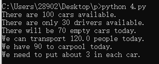
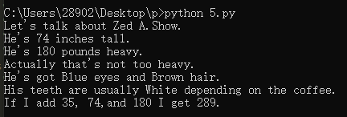

# 2019网络工作室暑期留校计划0711记录

### 笨办法学 Python

#### 习题 1: 第一个程序

```python 
print "Hello World!"
print "Hello Again"
print "I like typing this."
print "This is fun."
print 'Yay! Printing.'
print "I'd much rather you 'not'."
print 'I "said" do not touch this.'

```


#### 习题 2: 注释和井号

```python
# A comment,this is so you can read your program later.
# Anything after the # is ignored by python.
print "I could have code like this." # and the comment after is ignored
# You can also use a comment to "disable" or comment out a piece of code:
# print "This won't run."
print "This will run."
```


#### 3: 数字和数学计算

```python
print "I will now count my chickens:"
print "Hens",25+30/6
print "Roosters",100-25*3%4
print "Now I will count the eggs:"
print 3+2+1-5+4%2-1/4+6
print "Is it true that 3+2<5-7?"
print 3+2<5-7
print "What is 3+2?",3+2
print "What is 5-7?",5-7
print "Oh, that's why it's False."
print "How about some more."
print "Is it greater?",5>=-2
print "Is it greater?",5<=-2
```


#### 习题 4: 变量(variable)和命名

```python
cars =100
space_in_a_car=4.0
drivers=30 
passengers=90
cars_not_driven=cars-drivers
cars_driven=drivers
carpool_capacity=cars_driven*space_in_a_car
average_passengers_per_car=passengers/cars_driven

print "There are",cars,"cars available."
print "There are only",drivers, "drivers available."
print "There will be",cars_not_driven, "empty cars today."
print "We can transport",carpool_capacity,"people today."
print "We have",passengers,"to carpool today."
print "We need to put about",average_passengers_per_car,"in each car."
```



#### 习题 5: 更多的变量和打印

```python 
my_name ='Zed A.Show'
my_age= 35 # not a lie
my_height= 74 # inches
my_weight= 180 # lbs
my_eyes='Blue' 
my_teeth='White' 
my_hair='Brown'
print "Let's talk about %s." % my_name
print "He's %d inches tall." % my_height
print "He's %d pounds heavy." % my_weight
print "Actually that's not too heavy."
print "He's got %s eyes and %s hair."% (my_eyes,my_hair)
print "His teeth are usually %s depending on the coffee." % my_teeth
# this line is tricky,try to get it exactly right
print "If I add %d, %d,and %d I get %d." %(my_age,my_height,my_weight,my_age+my_height+my_weight)
```



