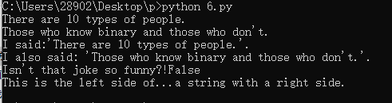
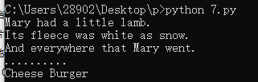
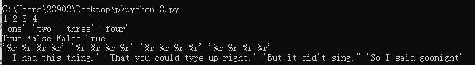
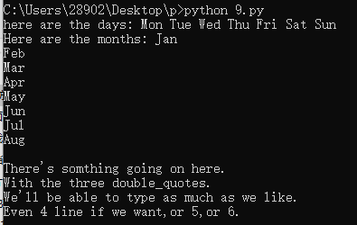
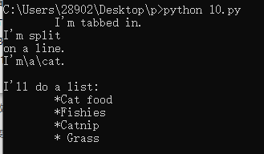
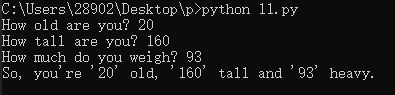
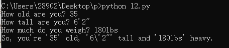

# 2019网络工作室暑期留校计划0712记录

### 笨办法学 Python

#### 习题 6: 字符串(string)和文本

```python
x="There are %d types of people."% 10
binary="binary"
do_not="don't"
y="Those who know %s and those who %s."%(binary,do_not)
print x
print y
print "I said:%r."%x
print "I also said: '%s'."%y
hilarious =False
joke_evaluation="Isn't that joke so funny?!%r"
print joke_evaluation%hilarious
w="This is the left side of..."
e="a string with a right side."
print w+e
```



#### 习题 7: 更多打印

```python
print "Mary had a little lamb."
print "Its fleece was white as %s."%'snow'
print "And everywhere that Mary went."
print "." *10 # what'd that do?
end1="C"
end2="h"
end3="e"
end4="e"
end5="s"
end6="e"
end7="B"
end8="u"
end9="r"
end10="g"
end11="e"
end12="r"
#watch that comma at the end. try removing it to see what happens
print end1+end2+end3+end4+end5+end6,
print end7+end8+end9+end10+end11+end12
```



### 习题 8: 打印，打印

```python
formatter="%r %r %r %r"
print formatter %(1,2,3,4)
print formatter %("one","two","three","four")
print formatter %(True,False,False,True)
print formatter %(formatter,formatter,formatter,formatter)
print formatter%(" I had this thing.","That you could type up right.","But it did't sing.","So I said goonight")
```



#### 习题 9: 打印，打印，打印

```python
# Here's some new strange stuff,remember type it exactly.
days="Mon Tue Wed Thu Fri Sat Sun"
months="Jan\nFeb\nMar\nApr\nMay\nJun\nJul\nAug"
print "here are the days:",days
print "Here are the months:",months
print """
There's somthing going on here.
With the three double_quotes.
We'll be able to type as much as we like.
Even 4 line if we want,or 5,or 6.
"""
```



#### 习题 10: 那是什么？

```python
tabby_cat="\tI'm tabbed in."
persian_cat="I'm split\non a line."
backslash_cat="I'm\\a\\cat."
fat_cat="""
I'll do a list:
\t*Cat food
\t*Fishies
\t*Catnip\n\t* Grass
"""
print tabby_cat
print persian_cat
print backslash_cat
print fat_cat
```



#### 习题 11: 提问

```python
print "How old are you?",
age = raw_input()
print "How tall are you?",
height = raw_input()
print "How much do you weigh?",
weight = raw_input()
print "So, you're %r old, %r tall and %r heavy." % (age, height, weight)
```



#### 习题 12: 提示别人

```
age = raw_input("How old are you? ")
height = raw_input("How tall are you? ")
weight = raw_input("How much do you weigh? ")
print "So, you're %r old, %r tall and %r heavy." % ( age, height, weight)
```

