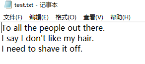

# 2019网络工作室暑期留校计划0713记录

### 笨办法学 Python

#### 习题 13: 参数、解包、变量

```python
from sys import argv
script,first,second,third=argv
print "The script is called:",script
print "Your first variable is:",first
print "Your second variable is:",second
print "Your third variable is:",third
```


#### 习题 14: 提示和传递

```python
from sys import argv
script,user_name=argv
prompt='>'

print "Hi %s,I'm the %s script." %(user_name,script)
print "I'd like to ask you a few questions."
print "Do you like me %s?" % user_name
likes =raw_input(prompt)

print "Where do you live %s?" %user_name
lives=raw_input(prompt)

print "What kind of computer do you have?"
computer =raw_input(prompt)
print """
Alright, so you said %r about liking me.
You live in %r. Not sure where that is.
And you have a %r computer. Nice.
""" %(likes,lives,computer)
```


#### 习题 15: 读取文件

```txt
This is stuff I typed into a file.
It is really cool stuff.
Lots and lots of fun to have in here.
```


```python
from sys import argv
script,filename=argv
txt=open(filename)
print "Here's your file %r:" %filename
print txt.read()
print "Type the filename again:"

file_again = raw_input("> ")

txt_again=open(file_again)
print txt_again.read()
```


#### 习题 16: 读写文件

- close – 关闭文件。跟你编辑器的 文件->保存.. 一个意思。
- read – 读取文件内容。你可以把结果赋给一个变量。
- readline – 读取文本文件中的一行。
- truncate – 清空文件，请小心使用该命令。
- write(stuff) – 将stuff写入文件。

```python
from sys import argv
script,filename=argv
print"We're going to erase %r." % filename
print"If you don't want that,hit CTRL-c(^c)."
print"If you do want that,hit RETURn."
raw_input("?")
print "Opening the file..."
target=open(filename,'w')
print"Truncating the file.Goodbye!"
target.truncate()
print"Now I'm going to ask you for three lines."

line1=raw_input("line1:")
line2=raw_input("line2:")
line3=raw_input("line3:")
print "I'm going to write these to the file."
target.write(line1)
target.write("\n")
target.write(line2)
target.write("\n")
target.write(line3)
target.write("\n")
print "And finally,we close it."
target.close()
```


打开你新建的文件 test.txt 检查一下里边的内容



#### 习题 17: 更多文件操作

```python
from sys import argv
from os.path import exists

script, from_file, to_file = argv

print "Copying from %s to %s" % (from_file, to_file)

# we could do these two on one line too, how?
input = open(from_file)
indata = input.read()

print "The input file is %d bytes long" % len(indata)

print "Does the output file exist? %r" % exists(to_file)
print "Ready, hit RETURN to continue, CTRL-C to abort."
raw_input()

output = open(to_file, 'w')
output.write(indata)

print "Alright, all done."

output.close()
input.close()
```


打开你新建的文件 copied.txt 检查一下里边的内容


#### 习题 18: 命名、变量、代码、函数

```python
# this one is like your scripts with argv
def print_two(*args):
    arg1, arg2 = args
    print "arg1: %r, arg2: %r" % (arg1, arg2)

# ok, that *args is actually pointless, we can just do this
def print_two_again(arg1, arg2):
    print "arg1: %r, arg2: %r" % (arg1, arg2)

# this just takes one argument
def print_one(arg1):
    print "arg1: %r" % arg1

# this one takes no arguments
def print_none():
    print "I got nothin'."


print_two("Zed","Shaw")
print_two_again("Zed","Shaw")
print_one("First!")
print_none()
```


#### 习题 19: 函数和变量

```python
def cheese_and_crackers(cheese_count,boxes_of_crackers):
	print "You have %d cheeses!" % cheese_count
	print "You have %d boxes of crackers!" %boxes_of_crackers
	print "Man that's enough for a party!"
	print "Get a blanket.\n"


print "We can just give the function numbers directly:"
cheese_and_crackers(20,30)


print "OR,we can use variables from our script:"
amount_of_cheese =10
amount_of_crackers =50

cheese_and_crackers(amount_of_cheese,amount_of_crackers)


print "We can even do math inside too:"
cheese_and_crackers(10+20,5+6)


print "And we can combine the two,variables and math:"
cheese_and_crackers(amount_of_cheese+100,amount_of_crackers+1000)

```


#### 习题 20: 函数和文件

```python
from sys import argv
script,input_file = argv
def print_all(f):
	print f.read()
def rewind(f):
	f.seek(0)

def print_a_line(line_count,f):
	print line_count,f.readline()

current_file =open(input_file)

print "First let's print the whole file:\n"
print_all(current_file)

print "Now let's rewind,kind of like a tape."
rewind (current_file)

print "Let's print three lines:"

current_line =1
print_a_line(current_line,current_file)


current_line=current_line +1
print_a_line(current_line,current_file)


current_line=current_line +1
print_a_line(current_line,current_file)
```

