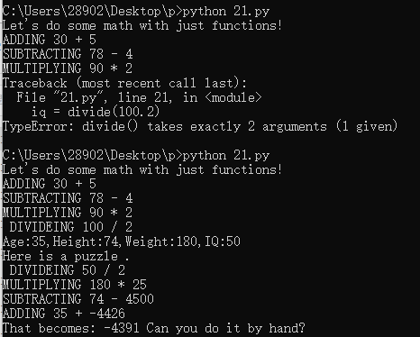
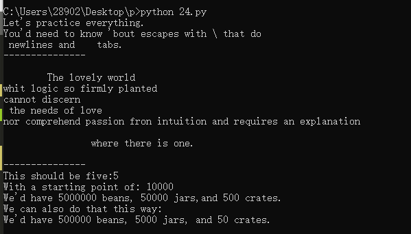
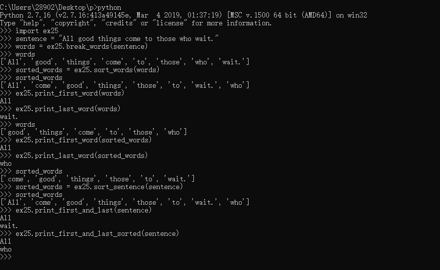
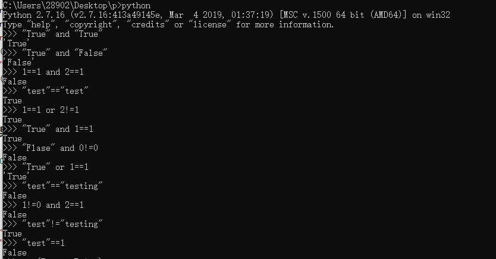
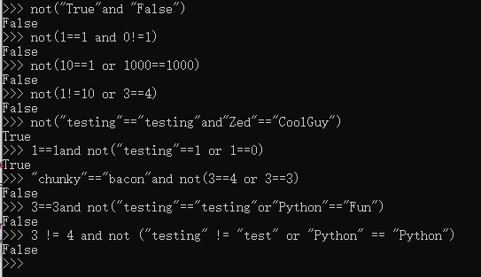
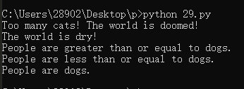
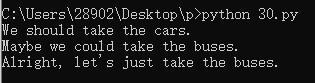

# 2019网络工作室暑期留校计划0715记录

### 笨办法学 Python

#### 习题 21: 函数可以返回东西

```python
def add(a,b):
	print "ADDING %d + %d" %(a,b)
	return a+b

def subtract(a,b):
	print "SUBTRACTING %d - %d" %(a,b)
	return a-b

def multiply(a,b):
	print "MULTIPLYING %d * %d" %(a,b)
	return a*b

def divide(a,b):
	print " DIVIDEING %d / %d" %(a,b)
	return a/b

print "Let's do some math with just functions!"
age = add(30,5)
height = subtract(78,4)
weight = multiply(90,2)
iq = divide(100,2)

print "Age:%d,Height:%d,Weight:%d,IQ:%d" %(age,height,weight,iq)


# A puzzle for the extra credit,type it in anyway.
print "Here is a puzzle ."

what = add(age,subtract(height,multiply(weight,divide(iq,2))))
print "That becomes:",what,"Can you do it by hand?"
```



#### 习题 24: 更多练习

```python
print "Let's practice everything."
print 'You\'d need to know \'bout escapes with \\ that do \n newlines and \t tabs.'


poem = """
\tThe lovely world 
whit logic so firmly planted
cannot discern \n the needs of love
nor comprehend passion fron intuition and requires an explanation
\n\t\twhere there is one.
"""
print "---------------"
print poem
print "---------------"

five =10-2+3-6
print "This should be five:%s" %five

def secret_formula(started):
	jelly_beans = started * 500
	jars = jelly_beans / 100
	crates = jars /100
	return jelly_beans,jars,crates

start_point =10000
beans,jars,crates = secret_formula(start_point)

print "With a starting point of: %d" % start_point
print "We'd have %d beans, %d jars,and %d crates." % (beans,jars,crates)

start_point = start_point /10

print "We can also do that this way:"
print "We'd have %d beans, %d jars, and %d crates." %secret_formula(start_point)
```



#### 习题 25: 更多更多的练习

```python
def break_words(stuff):
    """This function will break up words for us."""
    words = stuff.split(' ')
    return words

def sort_words(words):
    """Sorts the words."""
    return sorted(words)

def print_first_word(words):
    """Prints the first word after popping it off."""
    word = words.pop(0)
    print word

def print_last_word(words):
    """Prints the last word after popping it off."""
    word = words.pop(-1)
    print word

def sort_sentence(sentence):
    """Takes in a full sentence and returns the sorted words."""
    words = break_words(sentence)
    return sort_words(words)

def print_first_and_last(sentence):
    """Prints the first and last words of the sentence."""
    words = break_words(sentence)
    print_first_word(words)
    print_last_word(words)

def print_first_and_last_sorted(sentence):
    """Sorts the words then prints the first and last one."""
    words = sort_sentence(sentence)
    print_first_word(words)
    print_last_word(words)
```



#### 习题 28: 布尔表达式练习

```python
"True" and "True"
"True" and "False"
1==1 and 2==1
"test"=="test"
1==1 or 2!=1
"True" and 1==1
"Flase" and 0!=0
 "True" or 1==1
"test"=="testing"
1!=0 and 2==1
"test"!="testing"
"test"==1
not("True"and "False")
not(1==1 and 0!=1)
not(10==1 or 1000==1000)
not(1!=10 or 3==4)
not("testing"=="testing"and"Zed"=="CoolGuy")
1==1and not("testing"==1 or 1==0)
"chunky"=="bacon"and not(3==4 or 3==3)
3==3and not("testing"=="testing"or"Python"=="Fun")
3 != 4 and not ("testing" != "test" or "Python" == "Python")
```





#### 习题 29: 如果(if)

```python
people = 20
cats = 30
dogs = 15


if people < cats:
    print "Too many cats! The world is doomed!"

if people > cats:
    print "Not many cats! The world is saved!"

if people < dogs:
    print "The world is drooled on!"

if people > dogs:
    print "The world is dry!"


dogs += 5

if people >= dogs:
    print "People are greater than or equal to dogs."

if people <= dogs:
    print "People are less than or equal to dogs."


if people == dogs:
    print "People are dogs."
```



#### 习题 30: Else 和 If

```python
people = 30
cars = 40
buses = 15


if cars > people:
    print "We should take the cars."
elif cars < people:
    print "We should not take the cars."
else:
    print "We can't decide."

if buses > cars:
    print "That's too many buses."
elif buses < cars:
    print "Maybe we could take the buses."
else:
    print "We still can't decide."

if people > buses:
    print "Alright, let's just take the buses."
else:
    print "Fine, let's stay home then."
```


